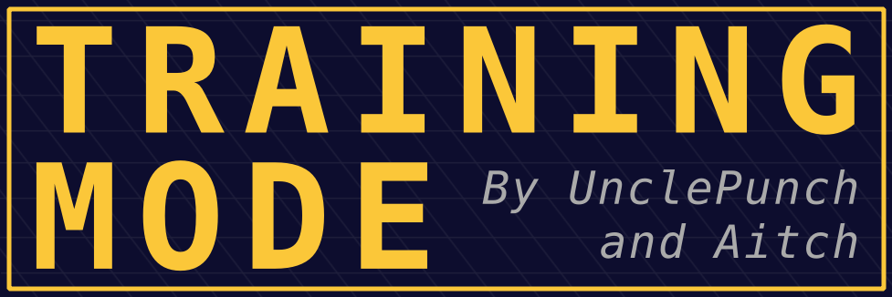



# Training Mode - Community Edition

Training Mode - Community Edition is an expanded and updated version of UnclePunch's training modpack for Super Smash Bros. Melee.

To download the ISO, click [here](https://github.com/AlexanderHarrison/TrainingMode-CommunityEdition/releases/latest).

Join [the discord](https://discord.gg/2Khb8CVP7A) to discuss changes, new features, or ask for assistance.

## Changes From the Original
- Global Changes:
    - Updated to UCF 0.84 (Allows practicing with dashback out of crouch).
    - Hitboxes are now colored by ID and sorted by priority.
    - Wavedash OSD now shows if it was a short hop or full hop.
    - Added glide toss, aerial out of double jump, special out of jump, and double jump out of jump OSDs.
- New Training Lab Features:
    - Recording:
        - Reworked recording UI. Allows re-saveing existing recordings with different percents or positioning.
        - Savestates now require holding DPad right, preventing accidental savestates.
        - Set chances for slots during random playback.
        - Option to auto-restore state when the CPU performs a counter action.
        - Takeover HMN playback at any point.
        - Press DPad left/right when browsing savestates to quickly change pages.
        - Taunt is disabled by default.
        - Savestates can now always be saved. (May cause crashes if you save during special moves).
    - CPU Options:
        - Random custom DI option. The CPU will pick a random option from your custom TDI.
        - CPU Shield angling options.
        - Added Wavedash counter actions.
        - Tech animations can be set invisible after they are distinguishable.
        - Added usmash OoS and all specials moves as counter actions.
        - All special moves can be used as counter actions.
        - Neutral jump action, set as the default.
        - SDI and ASDI options.
        - SDI is now set by number of inputs rather than by chance.
        - SDI and mashing are set to none by default.
    - Other Changes:
        - Game speed option.
        - Color overlays.
        - Lock percents.
        - Hazard toggle.
        - Show input and info displays for both HMN and CPU.
- Bugfixes/Small Changes:
    - **Fixed cpu acting too late out of sakurai angle and other non-knockdown hits (such as fox drill).**
    - Adjustable timing in Amsah tech event.
    - Jump actions no longer make the CPU self-destruct.
    - Various OSDs have been fixed.
    - Lightshield now works in recordings.
    - Fix CPU DI on back throws and moves that send backwards.
    - Can now use lightshield L with DPad to adjust percents.
    - Sopo is used for the ledgedash event.
    - CPUs now DI DK cargo throw.
    - Samus homing missiles will target the CPU.
    - Nana will not drop shield when Popo's shield is hit.
    - Added the polling drift fix.
    - Deleting replays too fast will no longer crash.
    - Every character can be used in Amsah Tech training.
- Work in progress:
    - Reaction Tech Chase Event
    - Fixing Sheik/Zelda savestate glitches
- Developer Features:
    - Simple and easily reproducible builds on Windows and Linux.
    - Fast recompilation on Linux using make.
    - Simplified and performant [tool](https://github.com/AlexanderHarrison/gc_fst) to extract and rebuild ISOs.

## Compilation

We have completely overhauled the build process.
Now any developer can easily compile an iso from source and add new features to the modpack.
Have some specific tech you want to train? Find a bug that's been annoying you? Come make a PR!

### Windows
1. [Install DevKitPro](https://github.com/devkitPro/installer/releases/latest). Install the Gamecube (aka PPC or PowerPC) package.
2. Drag your legally obtained SSBM v1.02 ISO on to the 'build_windows.bat' file. If all goes well, 'TM-CE.iso' will be created.

### Linux
1. [Install DevKitPro](https://devkitpro.org/wiki/Getting_Started#Unix-like_platforms). Install the Gamecube (gamecube-dev) package.
    - Ensure that `/opt/devkitpro/devkitPPC/bin/` is added to the PATH.
2. [Install Mono](https://www.mono-project.com/download/stable/#download-lin). Prefer installation through your package manager.
    - I would like nothing more than to remove mono, msbuild, .NET, C#, and Microsoft from my life. 
    Alas it is just as deeply ingrained the SSBM ecosystem as I am.
3. Install xdelta3. This should be simple to install through your package manager.
4. Run `make iso=path-to-melee.iso iso`. If all goes well, 'TM-CE.iso' will be created.
    - If the provided 'gecko' binary fails (likely due to libc issues), you can compile your own binary from [here](https://github.com/JLaferri/gecko/releases/tag/v3.4.0). **YOU MUST USE VERSION 3.4.0 OF GECKO OR IT WILL SILENTLY FAIL**.
    - If the provided 'gc_fst' binary fails (likely due to libc issues), you can compile your own binary from [here](https://github.com/AlexanderHarrison/gc_fst).

## How to make changes:  
- If you want to alter an event written in C (Easy):
    - The training lab, lcancel, ledgedash, and wavedash events are written in c. This makes them much easier to modify than the other events. Poke around in their source in `src/`.
    - If you're not familiar with other languages, then the C/H file distinction can be confusing.
        - In general, the C (source) files contain code, while the H (header) files contain data (such as static arrays) and types (structs, enums, unions).
        - Menus are arrays of `EventOption`s, so they are stored in H (header) files, along with any data they use.
    - The other events are written in assembly. 
- If you want to alter an event written in asm (Big Knowledge Check):
    - You will need to know a bit of Power PC asm.
    - Read `ASM/Readme.md`
    - Go to `ASM/training-mode/Custom Events/Custom Event Code - Rewrite.asm` and search for the event you want to modify.
    - These will trickier to modify than the other events. Prefer making a new event or modifying the lab.
    - There are a lot of random loads from random offsets there. If it's not listed in the ASM readme then I don't know what it is.
- If you want to make a new event (A little tricky):
    - Add a file and header to the `src/`.
    - Use HSDRaw to create an empty dat file in `dats/` with a single root.
        - If you want other assets, you can use HSDRaw to add new objects to that root, or copy them from the other events. Peek into the other dat files to see how this is done.
    - Add the required compilation steps in `Makefile` and `build_windows.bat`. Follow the same structure as the other events. Be sure to use the evFunction mode.
    - Add the `EventDesc` and `EventMatchData` structs to `events.c` and add a reference to them in the `General_Events`, `Minigames_Events`, or `Spacie_Events` array.
    - Ask Clown in the discord on what to do when something inevitably goes wrong (work to simplify making a new event is in progress!). 
    - Implement the `Event_Init`, `Event_Update`, `Event_Think` methods and `Event_Menu` pointer in your c file. Poke around the other events to figure out how the data flows.
    - Create an `EventMatchData` and `EventDesc` struct for the new event near the top of `events.c`.
    - Add a `.long 0` spacer word to the event jump list table (right after the `EventJumpTable` macro) for the page the event will be on in `Custom Event Code - Rewrite.asm`.
    - In `ASM/training-mode/Global.s`, increment `X.NumOfEvents` (where X is the name of the page it's on).
      Also, increment the event index for each legacy event on that page so they are pushed down in the menu.

- Other changes may be easy or difficult. Join [the discord](https://discord.gg/2Khb8CVP7A) if you want a nudge in the right direction.

## Debugging tips
- Set `TM_DEBUG` to 2 in events.h to get OSReport statements on the screen.
- **Use the dolphin debugger!** Make sure you have the latest version of dolphin for debugging.
    - To set a breakpoint, use the `bp()` fn call in C or the `SetBreakpoint` macro in ASM (which will clobber r3). Then when you boot up dolphin, put a breakpoint on the `bp` symbol.
    - **Be sure to load GTME01.map with Symbols->Load Other Map File!**

Feel free to DM me on discord (alex_aitch) or twitter (@rwing_aitch) for help!
